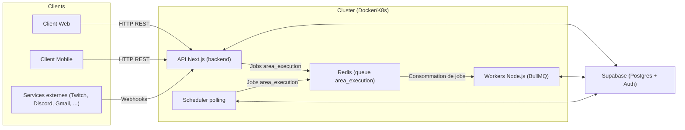
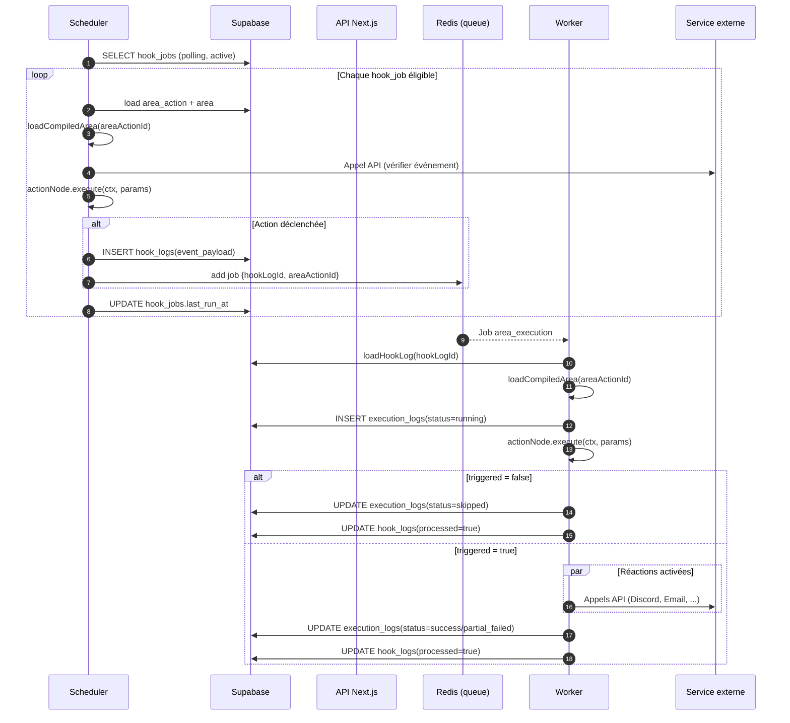
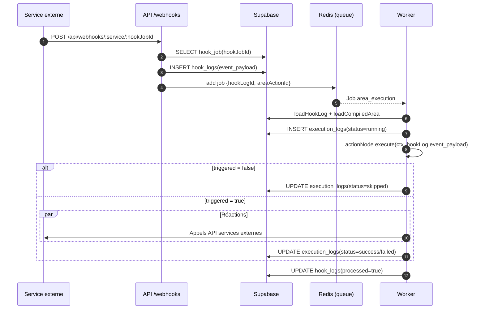

# Architecture Backend

## Objectifs

- Permettre à un utilisateur de créer des AREA composées d’une Action et de plusieurs Réactions.
- Supporter des déclencheurs **polling** et **webhooks**.
- Être scalable en ajoutant des workers supplémentaires (Kubernetes).
- Isoler la logique d’exécution dans un moteur générique, découplé des services externes.

## Composants

### 1. API / Main Service

Responsabilités :

- Authentification / gestion des utilisateurs.
- Gestion des services, actions, réactions (catalogue).
- Gestion des AREA (CRUD).
- Gestion des user_services (connexions OAuth).
- Webhooks :
  - Expose `/webhooks/:service/:hookJobId`.
  - Reçoit les événements externes, les logue et crée des jobs d’exécution.
- Scheduler :
  - Déclenche régulièrement les actions en polling.
  - Met à jour `hook_jobs.last_run_at`.
  - Crée des logs d’événements + jobs dans la queue.

Technologie :

- HTTP server (Express/Fastify/Gin/etc.).
- Client Supabase (pour Postgres + Auth).
- Client Redis / queue.

### 2. Worker Service

Responsabilités :

- Consommer la queue.
- Charger la définition d’un AREA (via Supabase).
- Exécuter l’Action node puis les Reaction nodes.
- Gérer erreurs et retries (en s’appuyant sur la queue).
- Ecrire dans `execution_logs` et marquer les `hook_logs.processed`.

Le worker tourne dans un ou plusieurs pods distincts de l’API.

### 3. Supabase (Postgres)

- Stocke l’ensemble des données métier (voir `DB_SCHEMA.md`).
- Fournit les identités OAuth (via `oauth_identities` + `user_services`).

### 4. Queue

- Redis (recommandé) + une library de job queue (BullMQ ou équivalent).
- Types de jobs principaux :
  - `area_execution` : exécuter une AREA pour un hook donné.
  - Optionnel : jobs internes pour le scheduler.

## Schéma global (vue haute niveau)

## Architecture Kubernetes

### Services

- `area-api` (main)
  - Deployment avec 1..N replicas.
  - Exposé via Ingress (HTTPS).
  - Variables d’env :
    - `SUPABASE_URL`
    - `SUPABASE_SERVICE_ROLE_KEY`
    - `REDIS_URL`
- `area-worker`
  - Deployment avec N replicas (scaling horizontal).
  - Pas de port exposé.
  - Même configuration Supabase + Redis.
- Redis
  - Soit géré dans le cluster, soit service managé.
- Supabase
  - Service managé externe.

### Flux principal (AREA)

1. L’utilisateur configure une AREA :
   - Choisit un service Action + paramètres (`area_actions`, `area_action_param_values`).
   - Choisit 1..N services Réaction + paramètres (`area_reactions`, `area_reaction_param_values`).
2. Le scheduler ou un webhook crée un `hook_logs` et pousse un job dans Redis :
   - Job = `{ type: "area_execution", hookLogId, areaActionId }`.
3. Un worker récupère le job :
   - Charge l’AREA complète (Action + Réactions).
   - Exécute l’Action node.
   - Si `triggered = true`, exécute toutes les Réactions (parallèle ou séquentiel).
4. Le worker logue les résultats dans `execution_logs`.

## Séquences d'exécution détaillées

### AREA déclenché par polling

### AREA déclenché par webhook

### Résilience & Scalabilité

- Les workers peuvent être multipliés.
- La queue gère les retries (backoff, nombre d’essais).
- L’API est stateless, seule la DB + Redis ont besoin de persistance.

# Shéma 

                 +----------------------+
                 |      Clients         |
                 |----------------------|
                 |  - Web (React)       |
                 |  - Mobile            |
                 +----------+-----------+
                            |
                      HTTP / REST
                            v
                 +----------------------+
                 |    API Backend       |
                 |   (Next.js / TS)    |
                 |----------------------|
                 | - /api/auth/*        |
                 | - /api/services/*    |
                 | - /api/me/areas/*    |
                 | - /api/webhooks/*    |
                 | - /about.json        |
                 +----+-----------+----+
                      |           |
          Requêtes DB |           |  Push de jobs
                      v           v
             +----------------+   +----------------+
             |   Supabase     |   |     Redis      |
             | (Postgres +    |   |  Queue BullMQ  |
             |   Auth)        |   |  (area_execution)
             +--------+-------+   +--------+-------+
                      ^                    |
                      |                    | Jobs
                      |                    v
               +------+---------------------------+
               |          Workers                |
               |   (Node.js, moteur AREA)        |
               |---------------------------------|
               | 1) charge CompiledArea          |
               | 2) exécute Action               |
               | 3) exécute Réactions            |
               | 4) écrit execution_logs         |
               +-----------------+---------------+
                                 |
                                 | logs / états
                                 v
                        +------------------+
                        |  execution_logs  |
                        |  hook_logs       |
                        +------------------+

             +----------------------------------+
             |          Scheduler               |
             |  (process Node.js séparé)        |
             |----------------------------------|
             | - lit hook_jobs (polling)        |
             | - exécute l’Action en “check”    |
             | - si event trouvé :              |
             |    -> crée hook_logs             |
             |    -> push job dans Redis        |
             +----------------------------------+

+----------------------+          +----------------------+
| Services externes    |  Webhook |                      |
| (Twitch, Discord,    +--------->|  API /webhooks/...  |
|  Gmail, ...)         |          +----------------------+
+----------------------+ 